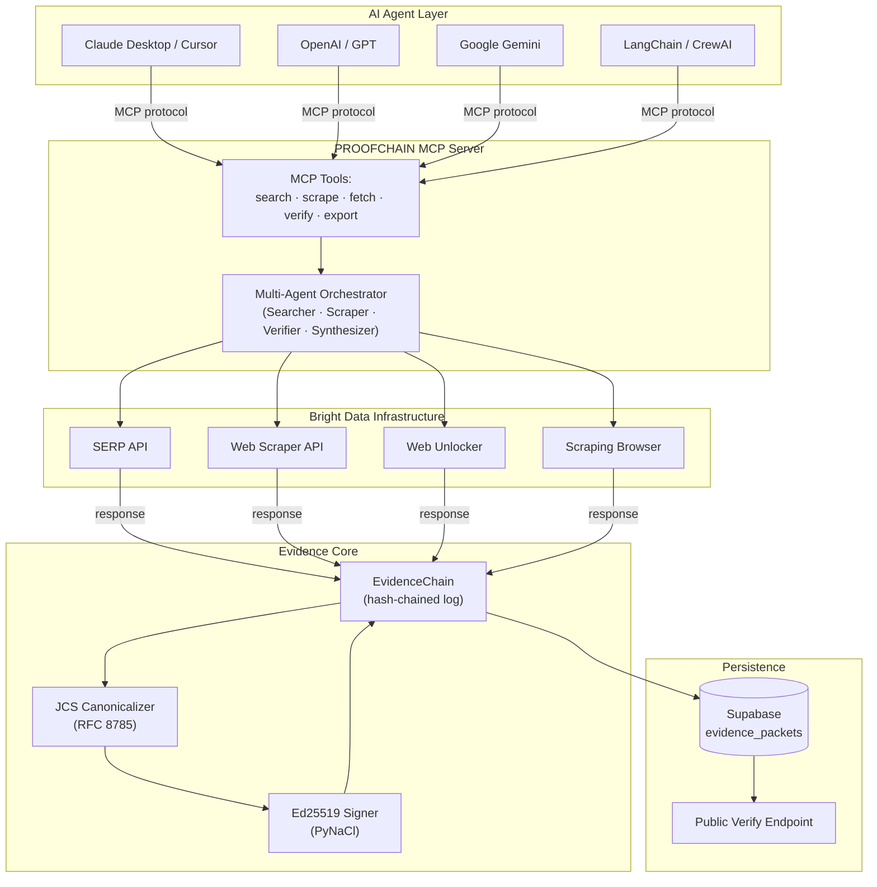
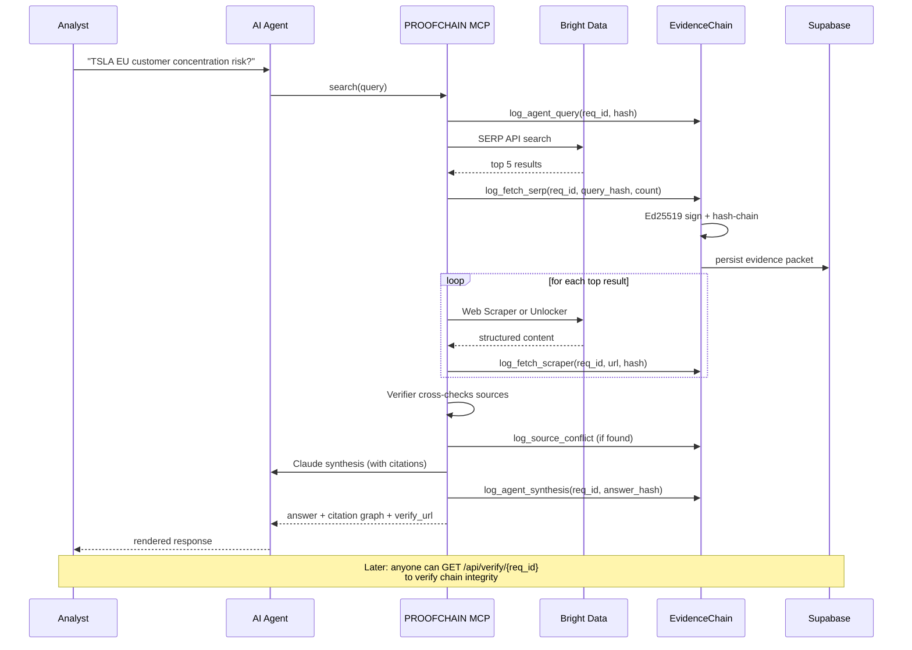
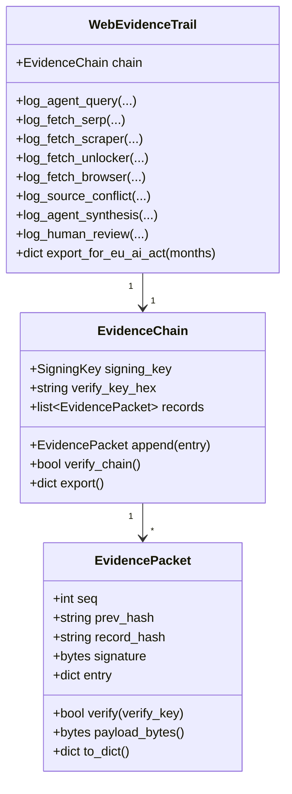
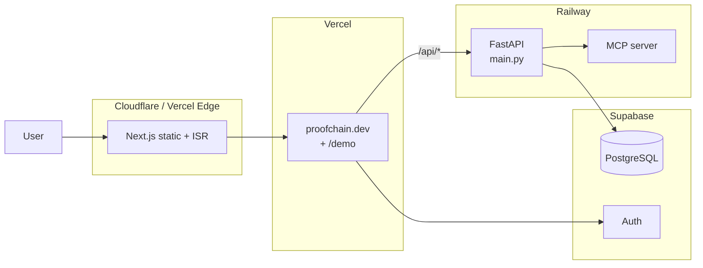

# PROOFCHAIN Architecture

## System overview

## Data flow — single research query

## Evidence packet schema

## Cryptographic properties (invariants)

| Property | Description | Guarantee |
|----------|-------------|-----------|
| **P1 — JCS determinism** | `canonical(X) == canonical(X)` always | RFC 8785 |
| **P2 — Sign+verify roundtrip** | `verify(sign(X), X) == OK` | Ed25519 / PyNaCl |
| **P3 — Tamper-decision** | Mutate `entry.content` → verify fails | SHA-256 hash + Ed25519 signature |
| **P4 — Hash-chain** | Each record commits to all previous | Linked via `prev_hash` |
| **P5 — EU AI Act Article 12** | 6-month retention export endpoint | Built-in |

## Deployment topology

## Security model

- **Signing keys are server-side** — never exposed to client. Generated on first deploy via PyNaCl `SigningKey.generate()`.
- **Verify keys are public** — anyone can verify a chain via `GET /api/verify/{request_id}`.
- **Robots.txt status is recorded** in every packet — proves we respected (or noted) crawler etiquette.
- **JWT auth** on `POST /api/research/` (post-kickoff Supabase Auth).
- **Rate limiting** on `POST /api/research/` — 10 req/min/IP free tier.

## Why hash-chained + Ed25519 (not just SHA-256)?

| Property | Plain SHA-256 | Ed25519 + chain |
|----------|---------------|-----------------|
| Detects tampering | ✓ | ✓ |
| Proves WHO produced it | ✗ | ✓ (public key) |
| Proves WHEN (relative) | ✗ | ✓ (chain order) |
| Court-admissible | partial | ✓ (with public verify key registry) |
| Reorderable | ✓ | ✗ (chain breaks) |

For legal-grade evidence (TD Bank fines, NYT v Perplexity), the chain + signature combination is the difference between "data you stored" and "data we will testify in court was produced at time T by entity E".
